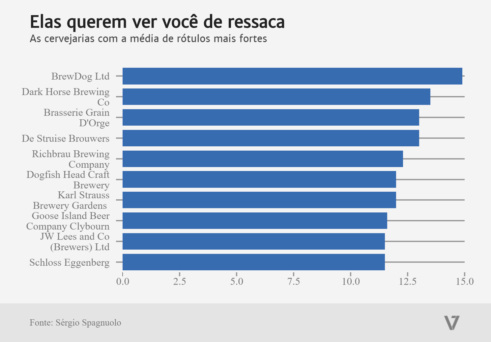

# Elas te querem de ressaca: as cervejarias com as médias de teor alcoólico mais fortes

Se você se deparar por aí, em um bar qualquer, com uma cerveja da BrewDog Ltd, é melhor se preparar. A cervejaria tem a média mais alta de teor alcóolico em seus rótulos. Ou seja: beba com moderação ou se prepare para a ressaca.

### [Fonte original](https://github.com/brewdega/open-beer-database-dumps)
